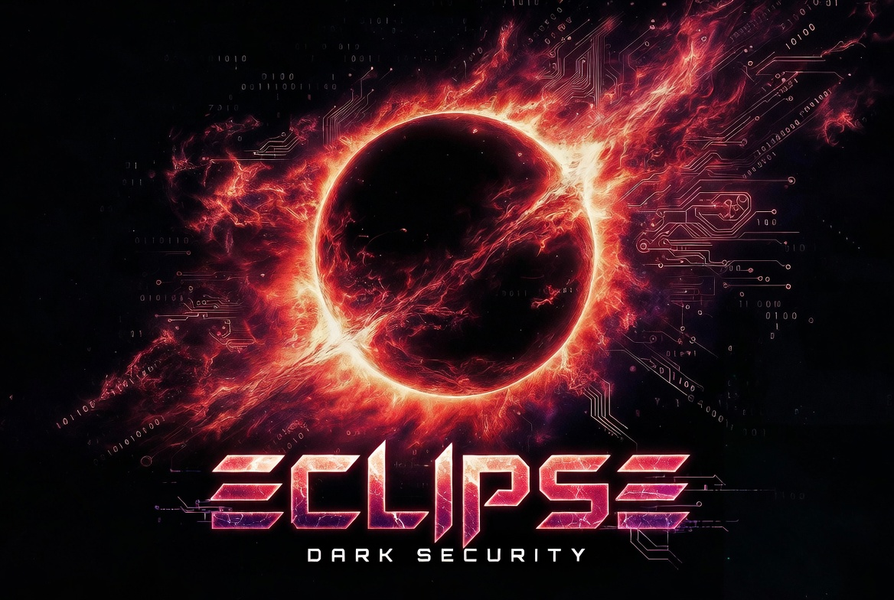

<div align="center">
  
</div>

<br>

# 🌌 Eclipse Security Suite

> **A Modular Purple Team Cybersecurity Ecosystem**
> Combining OSINT, Network Reconnaissance, Threat Hunting, Defensive Monitoring, Forensics, Vulnerability Analysis, and Infrastructure Auditing into one unified Python framework.


---

# 🏗️ Project Overview

**Eclipse Security Suite** is an integrated multi-engine cybersecurity platform engineered for:

* Security researchers
* Purple team operators
* Red team labs
* Blue team monitoring
* DevSecOps practitioners
* Malware analysts
* Security students and academy environments

The ecosystem combines multiple professional-grade Python sub-frameworks into a centralized orchestration environment powered by the master launcher:

```text
eclipse
```

Each framework remains independently deployable while also integrating seamlessly into the broader Eclipse ecosystem.

---

# ⚡ Core Ecosystem Capabilities

* Modular multi-tool architecture
* Cross-platform deployment support
* Global CLI launcher aliases
* Interactive terminal dashboards (TUI)
* Defensive and offensive research tooling
* Centralized ecosystem orchestration
* Standalone framework isolation
* Shared telemetry and wordlist infrastructure
* Research-grade packet and protocol analysis
* SIEM normalization and threat detection
* Container security auditing
* Web vulnerability assessment
* Network reconnaissance and OSINT collection

---

# 📁 Ecosystem Architecture & Repository Layout

```text
eclipse-security-suite/
│
├── pyproject.toml          # Master package configuration
├── requirements.txt        # Global dependency manifest
├── LICENSE                 # MIT licensing terms
├── eclipse.py              # Master ecosystem TUI launcher
├── README.md               # Ecosystem documentation
│
├── logs/                   # Centralized telemetry & audit logs
├── wordlists/              # Shared wordlists & payload repositories
├── config.example.yaml     # Global configuration template
│
├── AetherEye/              # OSINT & Infrastructure Intelligence
├── Apex/                   # Linux Privilege & Posture Auditor
├── BreachDeck/             # Dragon Interceptor LAN Analyzer
├── dexter/                 # Malware & Static Forensics Engine
├── DockSentry/             # Docker & Kubernetes Auditor
├── EagleEye/               # Network Recon & Enumeration
├── LogPulse/               # SIEM & Threat Hunting Platform
├── raptor/                 # Web Vulnerability Scanner
├── Raven/                  # Stateful Session Framework
└── titanbrute/             # Multi-Protocol Authentication Auditor
```

---

# 🛠️ The Framework Matrix

| Framework      | Operational Domain         | Description                                                              | Global Alias |
| -------------- | -------------------------- | ------------------------------------------------------------------------ | ------------ |
| **AetherEye**  | OSINT & Recon              | Email hunting, geolocation, Shodan auditing, infrastructure intelligence | `aethereye`  |
| **EagleEye**   | Network Recon              | Network discovery and asset enumeration                                  | `eagleeye`   |
| **Raven**      | Stateful Session Framework | Custom TCP remote administration & session orchestration                 | `raven-nest` |
| **LogPulse**   | SIEM & Threat Detection    | Log normalization, detection pipelines, telemetry analysis               | `logpulse`   |
| **TitanBrute** | Protocol Auditing          | Multi-protocol authentication verification framework                     | `titanbrute` |
| **DockSentry** | Container Security         | Docker, Kubernetes, and DevSecOps auditing                               | `docksentry` |
| **Apex**       | System Auditing            | Linux posture validation & privilege auditing                            | `apex`       |
| **dexter**     | Digital Forensics          | Static PE analysis & malware triage                                      | `dexter`     |
| **raptor**     | Web Security               | Web application & endpoint vulnerability analysis                        | `raptor`     |
| **BreachDeck** | Packet Analysis            | LAN broadcast interception & protocol telemetry                          | `breachdeck` |

---

# 🚀 Installation & Deployment

Eclipse utilizes modern Python packaging standards to provide globally accessible command-line tooling while preserving clean modular source layouts.

---

## 📦 1. Clone the Repository

```bash
git clone https://github.com/jonbytyqiii/eclipse-security-suite.git

cd eclipse-security-suite
```

---

## ⚙️ 2. Install Dependencies

```bash
pip install -r requirements.txt
```

---

## 🌌 3. Install the Ecosystem Launcher

```bash
pip install -e .
```

This registers:

* The global `eclipse` launcher
* All framework CLI aliases
* Shared ecosystem dependencies
* Cross-project utility modules

---

# 💻 Running the Ecosystem

Launch the master orchestration dashboard globally from any terminal session:

```bash
eclipse
```

---

## 🎯 Running Individual Frameworks

Each module can also operate independently.

Examples:

```bash
aethereye
```

```bash
logpulse
```

```bash
docksentry
```

```bash
breachdeck
```

```bash
raven-nest
```

---

# 📖 Operational Philosophy

Project Eclipse follows a distributed modular architecture:

* Every framework remains standalone and independently deployable
* Shared ecosystem assets remain centralized
* Global aliases reduce operational friction
* TUI-based orchestration improves usability
* Cross-project interoperability remains optional
* Defensive and offensive tooling coexist in isolated boundaries

This enables deployment flexibility across:

* Research labs
* Cybersecurity academies
* Isolated sandbox environments
* Portable analyst workstations
* Defensive monitoring infrastructures

---

# 🔒 Security Alignment & Compliance

This ecosystem was engineered explicitly for:

* Authorized infrastructure security assessments
* Defensive engineering workflows
* Threat hunting and telemetry analysis
* Incident response laboratories
* Malware analysis research
* Academic cybersecurity environments
* Systems programming education
* Purple team simulations

---

# ⚠️ Important Legal Notice

This toolkit is intended strictly for:

* Educational purposes
* Authorized security testing
* Research and laboratory simulations
* Defensive infrastructure auditing

Unauthorized usage against systems without explicit permission may violate local, regional, or international cybersecurity laws and regulations.

Certain modules — particularly authentication auditing, packet interception, or active reconnaissance engines — may generate detectable network activity or violate acceptable-use policies if deployed improperly.

Always ensure proper authorization boundaries exist before testing live environments.

---

# ⚡ Ecosystem Engineering Goals

Project Eclipse was designed around the following engineering principles:

* High modularity
* Stability-first architecture
* Research-grade extensibility
* Defensive operational visibility
* Portable deployment models
* Structured asynchronous workflows
* Clean Python package isolation
* Cross-platform compatibility
* Operator-focused terminal rendering

---

# 📊 Supported Operational Domains

| Domain                                | Coverage |
| ------------------------------------- | -------- |
| OSINT & Intelligence Gathering        | ✅        |
| Network Reconnaissance                | ✅        |
| SIEM & Threat Detection               | ✅        |
| Container Security Auditing           | ✅        |
| Vulnerability Assessment              | ✅        |
| Malware Triage & Forensics            | ✅        |
| Authentication Auditing               | ✅        |
| Protocol Visibility & Packet Analysis | ✅        |
| Infrastructure Telemetry              | ✅        |
| Security Research & Education         | ✅        |

---

# 📄 License

Distributed under the terms and conditions of the MIT License.

See the `LICENSE` file for complete licensing information.

---

# 👤 Author

**Jon Bytyqi**

Project Eclipse — Advanced Multi-Engine Cybersecurity Framework
Core Ecosystem Build v1.0.0
